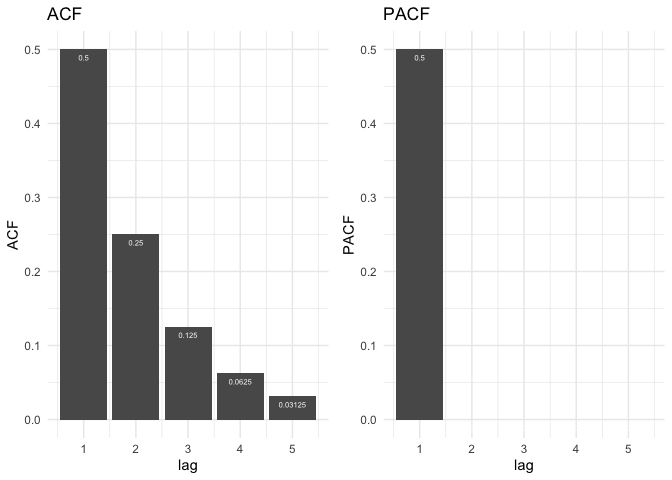
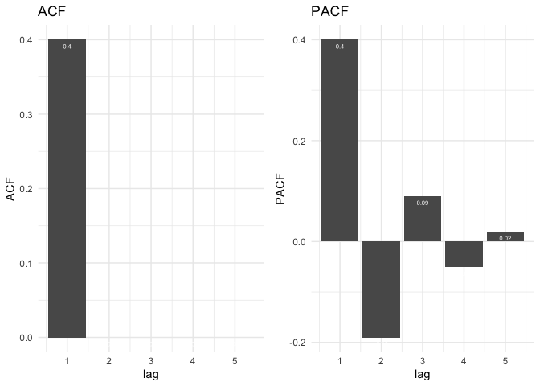
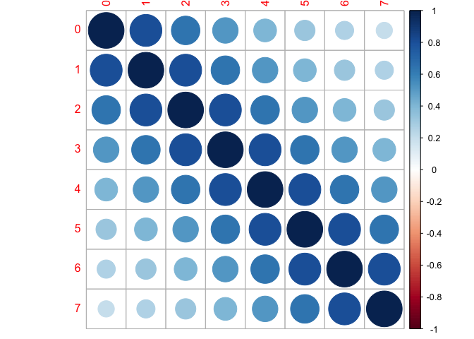
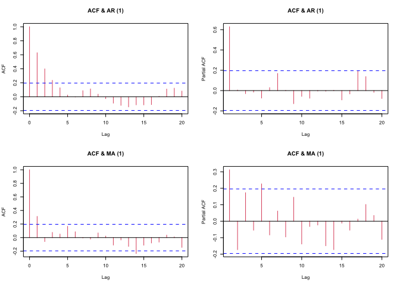
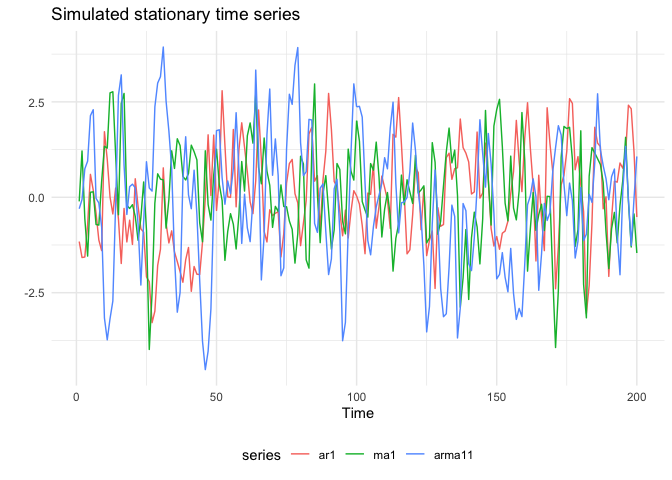
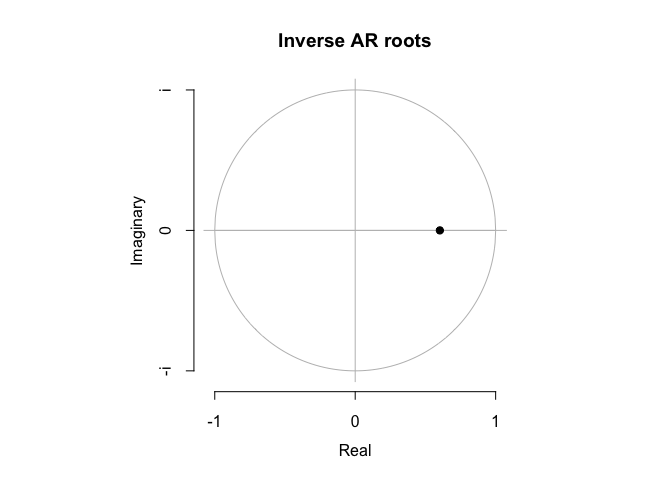
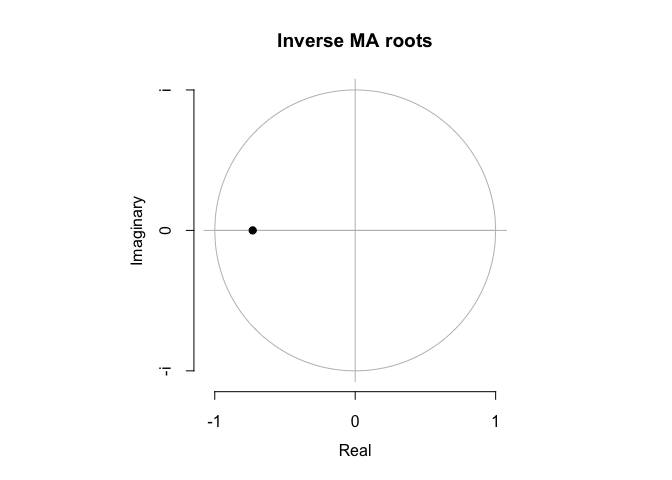
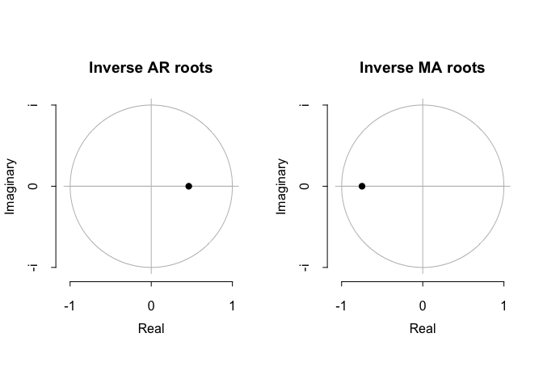
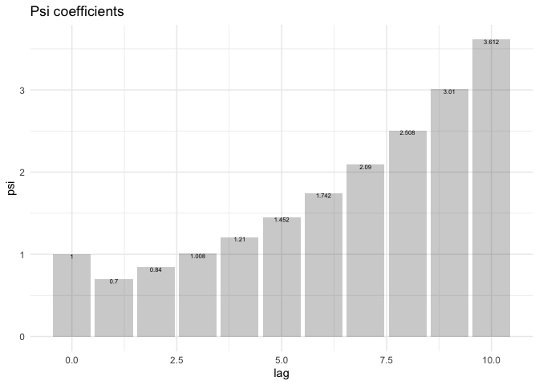

Modeling Irregular Component - ARMA model
================
Jin Seo Jo
06/10/2020

## ARMA model identificataion

### Mathematics behind ARMA model identification

Consider
\[X_{t} - \phi_{1}X_{t-1} - ... - \phi_{p}X_{t-p} = a_{t} + \theta_{1}a_{t-1} + ... + \theta_{q}a_{t-q}, \\ a_{t} \sim NID(0, \sigma_{a}^2)\]
where \(NID(0, \sigma_{a}^2)\) denotes IID normal random variables with
mean zero and variable \(\sigma_{a}^2\).  
Note that in this document we assume \(a_{t} \sim NID(0, \sigma_{a}^2)\)

### Use R to check your answers

Calculate theorethical ACF and PACF of an ARMA model in R:  
`ARMAacf(ar = numeric(), ma = numeric(), lag.max = r, pacf = FALSE)`

#### Theoretical ACF and PACF of AR(1) process

``` r
ar.acf <- zapsmall(ARMAacf(ar = 0.5, lag.max = 5))[-1]
ar.pacf <- zapsmall(ARMAacf(ar = 0.5, lag.max = 5, pacf = TRUE))
ar.df <- data.frame(ACF = ar.acf, PACF = ar.pacf, lag = 1:5)

p1<- ggplot(data = ar.df, aes (x = lag, y = ACF)) +
  geom_bar(stat = "identity") +
  geom_text(aes(label = ACF), vjust = 2, size =2, color = "white") +
  theme_minimal() +
  ggtitle("ACF")

p2<- ggplot(data = ar.df, aes (x = lag, y = PACF)) +
  geom_bar(stat = "identity") +
  geom_text(aes(label = PACF), vjust = 2, size =2, color = "white") +
  theme_minimal() +
  ggtitle("PACF")

grid.arrange(p1,p2, nrow = 1)
```

<!-- -->

#### Theoretical ACF and PACF of MA(1) process

``` r
ma.acf <- round(zapsmall(ARMAacf(ma = 0.5, lag.max = 5))[-1], 2)
ma.pacf <- round(zapsmall(ARMAacf(ma = 0.5, lag.max = 5, pacf = TRUE)), 2)
ma.df <- data.frame(ACF = ma.acf, PACF = ma.pacf, lag = 1:5)

p3 <- ggplot(data = ma.df, aes(x = lag, y = ACF)) +
  geom_bar(stat = "identity") +
  geom_text(aes(label = ACF), vjust = 2, size = 2, color = "white") +
  theme_minimal() +
  ggtitle("ACF")

p4 <- ggplot(data = ma.df, aes(x = lag, y = PACF)) +
  geom_bar(stat = "identity") +
  geom_text(aes(label = PACF), vjust = 2, size = 2, color = "white") +
  theme_minimal() +
  ggtitle("PACF")

grid.arrange(p3, p4, nrow = 1)
```

<!-- -->

Autocorrelation matrix as Toeplitz matrix

``` r
m <- toeplitz(ARMAacf(0.8, lag.max = 7))
rownames(m) = 0:7
colnames(m) = 0:7
kable(m, digits = 2, caption = "Autocorrelation matrix", format = "markdown")
```

|   |    0 |    1 |    2 |    3 |    4 |    5 |    6 |    7 |
| :- | ---: | ---: | ---: | ---: | ---: | ---: | ---: | ---: |
| 0 | 1.00 | 0.80 | 0.64 | 0.51 | 0.41 | 0.33 | 0.26 | 0.21 |
| 1 | 0.80 | 1.00 | 0.80 | 0.64 | 0.51 | 0.41 | 0.33 | 0.26 |
| 2 | 0.64 | 0.80 | 1.00 | 0.80 | 0.64 | 0.51 | 0.41 | 0.33 |
| 3 | 0.51 | 0.64 | 0.80 | 1.00 | 0.80 | 0.64 | 0.51 | 0.41 |
| 4 | 0.41 | 0.51 | 0.64 | 0.80 | 1.00 | 0.80 | 0.64 | 0.51 |
| 5 | 0.33 | 0.41 | 0.51 | 0.64 | 0.80 | 1.00 | 0.80 | 0.64 |
| 6 | 0.26 | 0.33 | 0.41 | 0.51 | 0.64 | 0.80 | 1.00 | 0.80 |
| 7 | 0.21 | 0.26 | 0.33 | 0.41 | 0.51 | 0.64 | 0.80 | 1.00 |

Autocorrelation
matrix

``` r
corrplot(m)
```

<!-- -->

### Rule of Thumb

|           |              ACF              |             PACF              |
| :-------: | :---------------------------: | :---------------------------: |
|   AR(p)   | Tails off or damped sine wave |      Cut off after lag p      |
|   MA(q)   |      Cut off after lag q      | Tails off or damped sine wave |
| ARMA(p,q) |   Tails off after lag(q-p)    |   Tails off after lag(p-q)    |

``` r
set.seed(5678)
sim.ar1 <- arima.sim(n = 100, list(ar = 0.5))
sim.ma1 <- arima.sim(n = 100, list(ma = 0.5))

par(mfrow = c(2,2), cex = 0.5)
acf(sim.ar1, main = "ACF & AR (1)", col = 2);pacf(sim.ar1, main = "ACF & AR (1)", col = 2)
acf(sim.ma1, main = "ACF & MA (1)", col = 2);pacf(sim.ma1, main = "ACF & MA (1)", col = 2)
```

<!-- -->

## Checking stationary of ARMA models

### Stationary of ARMA models

**How can we tell if a given ARMA model is stationary?**  
Show that a given ARMA model satisfying the definition of weak
stationary.

**A general approach to test stationary of an ARMA model** Consider an
ARMA(p,q) model \[\phi(B)X_{t} = \theta(B)a_{t}\] where
\[\phi(B) = 1 - \phi_{1}B - \phi_{2}B^2 - ... - \phi_{p}X_{t-p}, \\ \theta(B) = 1 + \theta_{1}B + \theta_{2}B^2 + ... + \theta_{q}B^q\]
and \(B^kX_{t} = X_{t-k}\) is the backward shift operator.

**If an ARMA process defined in the equation is stationary, all roots in
\(\phi(B)\) must lie outside a unit circle.**

### Simulated examples

Consider the following simulated ARMA processes
\[ X_{t} - 0.5X_{t-1} = a_{t}, \; a_{t} \sim NID(0,1) \\
X_{t} = a_t + 0.7a_{t-1}, \; a_{t} \sim NID(0,1) \\
X_{t} - 0.5X_{t-1} = a_t + 0.7a_{t-1}, \; a_{t} \sim NID(0,1)\]

``` r
# Simulated time series
set.seed(1234)
ar1 <- arima.sim(list(order = c(1,0,0), ar = 0.5), n = 200)
ma1 <- arima.sim(list(order = c(0,0,1), ma = 0.7), n = 200)
arma11 <- arima.sim(list(order = c(1,0,1), ar = 0.5, ma = 0.7), n = 200)

autoplot(cbind(ar1, ma1, arma11)) +
  ggtitle("Simulated stationary time series") +
  theme_minimal() +
  ylab("") +
  theme(legend.position = "bottom")
```

<!-- -->

AR(1) model

``` r
mod.ar1 <- arima(ar1, c(1,0,0))
coef(mod.ar1) %>% kable()
```

|           |           x |
| :-------- | ----------: |
| ar1       |   0.6029276 |
| intercept | \-0.0433847 |

``` r
plot(mod.ar1)
```

<!-- -->

MA(1) model

``` r
mod.ma1 <- arima(ma1, c(0,0,1))
coef(mod.ma1) %>% kable()
```

|           |         x |
| :-------- | --------: |
| ma1       | 0.7298466 |
| intercept | 0.0461786 |

``` r
plot(mod.ma1)
```

<!-- -->

ARMA(1,1) model

``` r
mod.arma11 <- arima(arma11, c(1,0,1))
coef(mod.arma11) %>% kable()
```

|           |           x |
| :-------- | ----------: |
| ar1       |   0.4621478 |
| ma1       |   0.7485001 |
| intercept | \-0.1145260 |

``` r
plot(mod.arma11)
```

<!-- -->

## Causal and invertible representation of an ARMA model

### Definition

  - An ARMA model is a causal process if it can be expressed as a
    stationary \(MA(\infty)\) process
    \[X_{t} = \sum_{i=0}^{\infty} \psi_{i}a_{t-i}\]
  - An ARMA model is an invertible process if it can be expressed as a
    stationary \(AR(\infty)\) process
    \[X_{t} - \sum_{i=0}^{\infty} \pi_{i}X_{t-i} = a_{t}\]
  - We can use R to calculate \(\psi\) coefficients.

### Nonstationary ARMA model

Consider the following ARMA model
\[ X_{t} - 1.2X_{t-1} = a_{t} + 0.5a_{t-1}\]

``` r
library(FitARMA)
```

    ## Loading required package: FitAR

    ## Loading required package: lattice

    ## Loading required package: leaps

    ## Loading required package: ltsa

    ## Loading required package: bestglm

    ## 
    ## Attaching package: 'FitAR'

    ## The following object is masked from 'package:forecast':
    ## 
    ##     BoxCox

``` r
psi <- ImpulseCoefficientsARMA(phi = 1.2, theta = 0.5, lag.max = 10) %>% 
  round(digits = 3)

psi.df <- data.frame(lag = 0:(length(psi)-1), psi = psi)

ggplot(data = psi.df, aes(x = lag, y = psi)) +
  geom_bar(stat = "identity", alpha = 0.3) +
  geom_text(aes(label = psi), vjust = 1, size = 2, color = "black") +
  theme_minimal() +
  ggtitle("Psi coefficients")
```

<!-- -->
