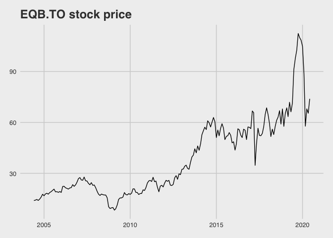
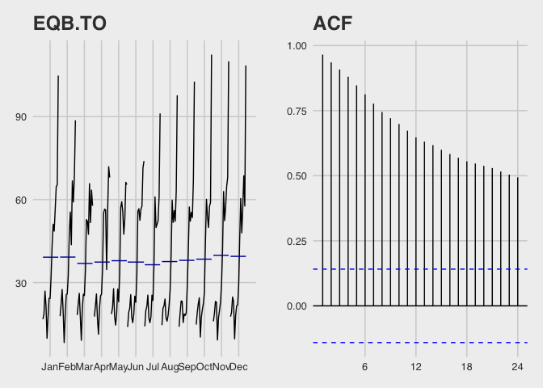
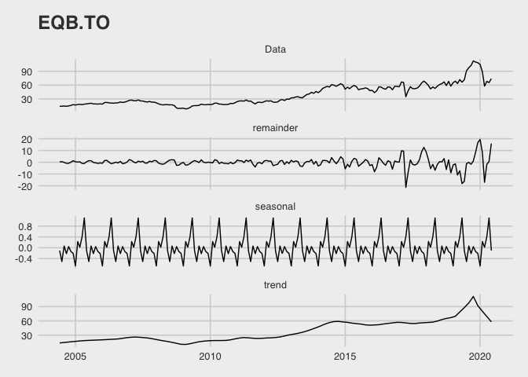
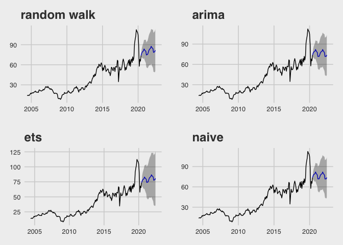

EQB.TO Stock Price
================
Jin Seo Jo
28/09/2020

## Stylized fact of time series

### Examnine the stock price of EQB.TO

``` r
eqb_data <- ts(read.csv("EQB.TO.csv", header = TRUE)[,6], frequency =  12, start = c(2004, 6))

autoplot(eqb_data) + 
  theme_fivethirtyeight() +
  ggtitle("EQB.TO stock price")
```

<!-- -->

### The stiationary of a time series is usually examined using the unit root test.

``` r
adf.test(eqb_data)
```

    ## 
    ##  Augmented Dickey-Fuller Test
    ## 
    ## data:  eqb_data
    ## Dickey-Fuller = -2.724, Lag order = 5, p-value = 0.2732
    ## alternative hypothesis: stationary

``` r
g3 <- ggsubseriesplot(eqb_data) +
  theme_fivethirtyeight() +
  ggtitle("EQB.TO")

g4 <- ggAcf(eqb_data) +
  ggtitle("ACF") +
  theme_fivethirtyeight()

grid.arrange(g3, g4, ncol = 2)
```

<!-- -->

## Time Series Decompostion

``` r
eqb_data %>% stl(t.window = 13, s.window = "periodic", robust = TRUE) %>% 
  autoplot() +
  ggtitle("EQB.TO") +
  theme_fivethirtyeight()
```

<!-- -->

## Forecasting

``` r
fit1 <- stlf(eqb_data, method = "rwdrift")
fit2 <- stlf(eqb_data, method = "arima")
fit3 <- stlf(eqb_data, method = "ets")
fit4 <- stlf(eqb_data, method = "naive")

l1 <- autoplot(fit1) +
  ggtitle("random walk") +
  theme_fivethirtyeight()
```

    ## Warning: `filter_()` is deprecated as of dplyr 0.7.0.
    ## Please use `filter()` instead.
    ## See vignette('programming') for more help
    ## This warning is displayed once every 8 hours.
    ## Call `lifecycle::last_warnings()` to see where this warning was generated.

``` r
l2 <- autoplot(fit2) +
  ggtitle("arima") +
  theme_fivethirtyeight()
l3 <- autoplot(fit3) +
  ggtitle("ets") +
  theme_fivethirtyeight()
l4 <- autoplot(fit4) +
  ggtitle("naive") +
  theme_fivethirtyeight()

grid.arrange(l1, l2, l3, l4, ncol = 2)
```

<!-- -->
