Introduction to Time Series
================
Jin Seo Jo
05/10/2020

``` r
library(fpp3)
library(ggplot2)
library(ggfortify)
library(tidyverse)
library(tidyquant)
library(forecast)
library(dygraphs)
```

## What is Time Series?

### Time seires data

Definition: data collected sequentially over time

What does this time series data look like?

``` r
# Note: `AirPassengers` comes from `fpp3`
AirPassengers
```

    ##      Jan Feb Mar Apr May Jun Jul Aug Sep Oct Nov Dec
    ## 1949 112 118 132 129 121 135 148 148 136 119 104 118
    ## 1950 115 126 141 135 125 149 170 170 158 133 114 140
    ## 1951 145 150 178 163 172 178 199 199 184 162 146 166
    ## 1952 171 180 193 181 183 218 230 242 209 191 172 194
    ## 1953 196 196 236 235 229 243 264 272 237 211 180 201
    ## 1954 204 188 235 227 234 264 302 293 259 229 203 229
    ## 1955 242 233 267 269 270 315 364 347 312 274 237 278
    ## 1956 284 277 317 313 318 374 413 405 355 306 271 306
    ## 1957 315 301 356 348 355 422 465 467 404 347 305 336
    ## 1958 340 318 362 348 363 435 491 505 404 359 310 337
    ## 1959 360 342 406 396 420 472 548 559 463 407 362 405
    ## 1960 417 391 419 461 472 535 622 606 508 461 390 432

Plot the time series of `AirPassengers` - simple R plot and interactive
time series plot

``` r
# Simple R plot
plot(AirPassengers, type = "o", main = "Monthly Airline Passenger Numbers 1949-1960")
grid()
```

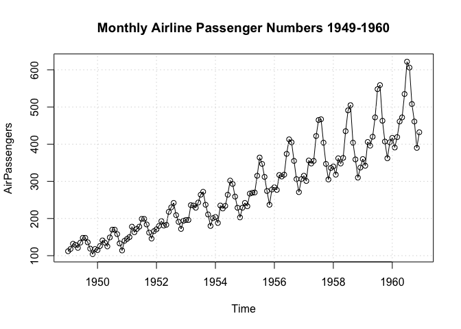<!-- -->

``` r
# Interactive time series plot
# dygraph(AirPassengers)
```

``` r
# Seasonal plot using R basic function
monthplot(AirPassengers)
```

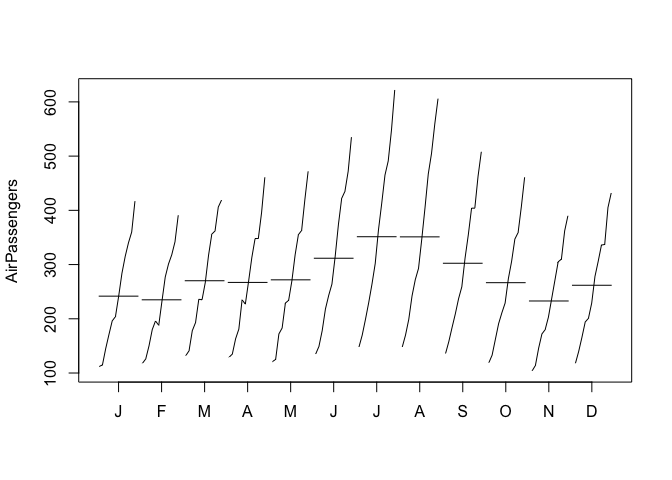<!-- -->

#### Stylized facts or empirical chracteristics of time series data

From the above Airline passenger data set, we can see  
\- Trend - Seasonality - Non-constant variance - Serially correlated
(autocorrelated) observations

### Time series model

#### Time series model

**Time series models** are mathematical models to capture the main
characteristics of time series data, such as autoregressive moving
average model (ARMA) and generalized autoregressive conditional
heteroskedasticity (GARCH) model.

#### White noise

A time series is **white noise** if the variables are IID with a mean of
zero.  
\(X_{t}\) is a white noise process if it satisfies  
1\) \(E(X_{t}) = 0, \forall t\)  
2\) \(Var(X_{t}) = \sigma^2, \forall t\)  
3\) \(Cov(X_{t}, X_{s}) = 0, \forall t \neq s\) That is,
\(X_{t} \sim NID(0, \sigma^2)\)

#### Autocovariance and autocorrelation functions

  - **Autocovariance function**:
    \(\gamma(h) = Cov(X_{t}, X_{t+h}), \forall t,s\)
  - **Autocorrelation function (ACF)**:
    \(\rho(h) = \frac{\gamma(h)}{\gamma(0)}\) Note: h represents time
    lag

#### Weak Stationarity

1)  Stochastic process as a collection of random variables (random
    vector) over time  
2)  Strict stationaryity implies weak stationarity  
3)  Weak Stationarity:

<!-- end list -->

1)  \(E(X_{t}) = \mu < \infty\)
2)  \(E(|X_{t}|^2) = c < \infty\)
3)  \(Cov(X_{t}, X_{s}) = f(|t-s|)\) and independent of time  
    Example:
    \(Cov(X_{1}, X_{5}) = Cov(X_{2}, X_{6}) = Cov(X_{t}, X_{t+4}) = f(|4|)\)

#### Sample autocovariance and autocorrelation functions

  - How is SACF plot constructed?
    \[\hat{\rho} \sim N(0, \frac{1}{n}), \; h = 1,2,3,...\]
  - What do we see from the SACF plot of the simulated time series?

<!-- end list -->

``` r
# Simulate a white noise process
# 100 IID observations from standard normal distribution
set.seed(1234)
simRV <- rnorm(100)
acf(simRV, col = 2, main = "SACF of simulated Gaussian time series", cex = 0.75)
```

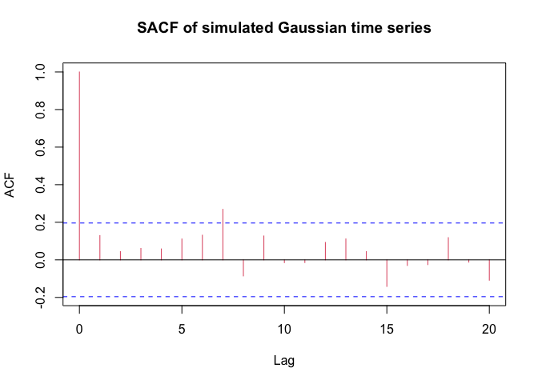<!-- -->

## Introduction to Time Series Modelling

Classical decomposition decomposes time series into trend,
seasonal/cyclical, and irregular components.

#### Methods to model **trend** component:

  - function of time
  - differencing (Box-Jenkins approach)
  - Other smoothing methods, such as moving average and LOESS

#### Methods to model **seasonal** component:

  - functions of dummmy variables or collection of sine and cosine
    funcitons
  - Seasonal differencing (Box-Jenkins approach)
  - Other methods, such as periodic time series model

#### Methods to model irregular component:

  - Box-Jenkins approach ( autoregressive and moving average model)
  - Others

### Classical decomposition in R

To apply classical decomposition, we first resolve **non-constant
variance**

``` r
# Estimate the parater of transformation using "forcast" package
lambda <- BoxCox.lambda(AirPassengers)
# Transform "AirPassengers" data using variance stablizing transformation. 
air <- ts(BoxCox(AirPassengers, lambda), start = c(1949, 1), freq = 12)
plot(air, type = "o", main = "Monthly Airline Passenger Numbers 1949-1960 after transformation")
grid()
```

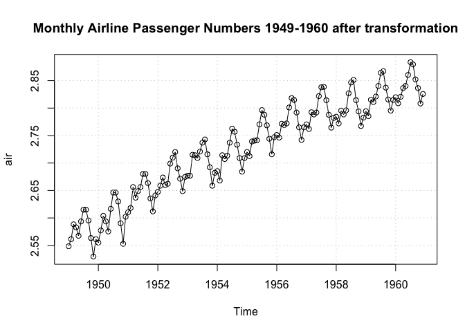<!-- -->

``` r
# Plot time series data using autoplot/ggplot2
autoplot(air) + 
  ggtitle("Monthly Airline Passenger Numbers 1949-1960 after transformation") +
  ylab("thousand") +
  xlab("time") +
  theme_minimal()
```

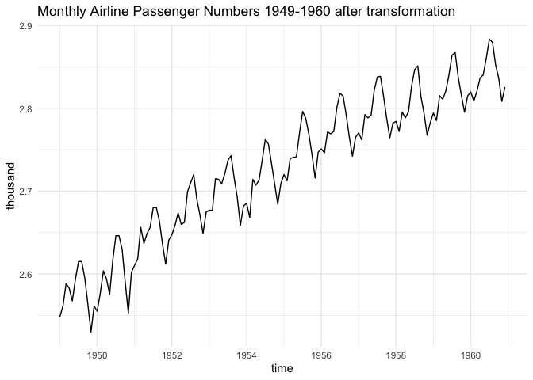<!-- -->

We then conduct the classical decomposition using `stl`
function.

``` r
plot(stl(air, s.window = 35), main = "Illustration of classical decomposition using STL")
```

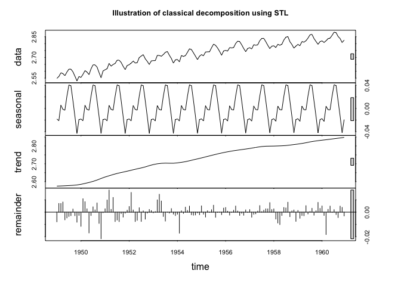<!-- -->

Alternatively, we may conduct clssical decomposition using decompose
funciton.

``` r
plot(decompose(air))
```

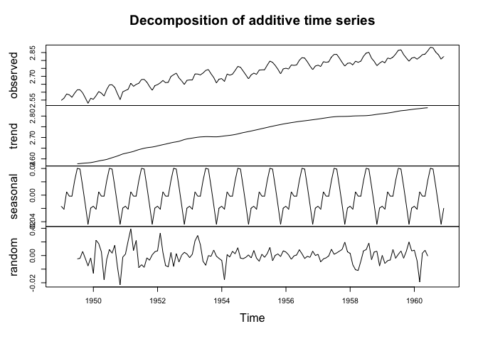<!-- -->

Retrieve components of classical decomposition

``` r
# What do we have after using `stl`
air.stl <- stl(air, s.window = 35)
names(air.stl)
```

    ## [1] "time.series" "weights"     "call"        "win"         "deg"        
    ## [6] "jump"        "inner"       "outer"

``` r
# Output from classical decomposition
head(air.stl$time.series)
```

    ##              seasonal    trend    remainder
    ## Jan 1949 -0.018400877 2.574772 -0.007887426
    ## Feb 1949 -0.020936235 2.575205  0.007105851
    ## Mar 1949  0.005696292 2.575638  0.007073879
    ## Apr 1949 -0.001493221 2.576185  0.008245264
    ## May 1949 -0.002955276 2.576733 -0.006271702
    ## Jun 1949  0.021054342 2.577383 -0.004717031

``` r
# Pick up 'trend' component from the classical decomposition
autoplot(air.stl$time.series[,"trend"]) +
  ylab("") +
  ggtitle("Trend component") +
  theme_minimal()
```

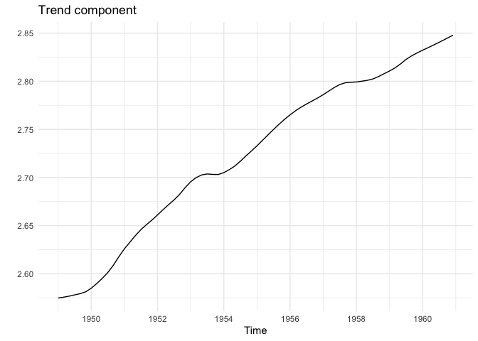<!-- -->

``` r
# Pick up 'seasonal' component from the classical decomposition
autoplot(air.stl$time.series[,"seasonal"]) +
  ylab("") +
  ggtitle("Seasonal component") +
  theme_minimal()
```

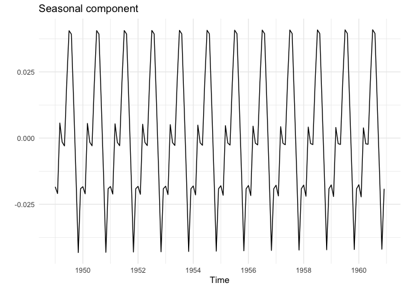<!-- -->

``` r
# Pick up 'irregular' component from the classical decomposition
autoplot(air.stl$time.series[,"remainder"]) +
  ylab("") +
  ggtitle("Irregular component") +
  theme_minimal()
```

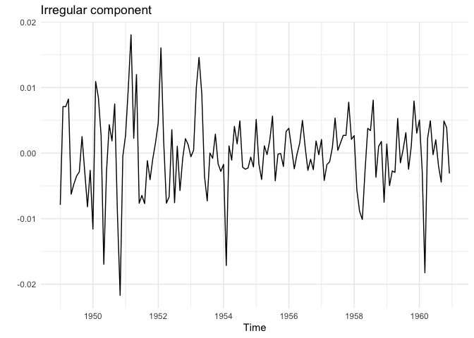<!-- -->

## Modeling Irregular Components Using ARMA Models

In this section, we consider the approach of modeling `irregular`
component using Box-Jenkins approach (or ARMA models).

### Mathematical formulation of ARMA models

  - ARMA modles assume that time series \(\{X_{t}\}\) is weakly
    stationary and satisfies the following representation:
    \[X_{t} - \phi_{1}X_{t-1} - ... - \phi_{p}X_{t-p} = a_{t} + \theta_{1}a_{t-1} + ... + \theta_{q}a_{t-q}, \\ a_{t} \sim WN(0, \sigma^2)\]
    If \(\{X_{t}\}\) satisfies the above equation, we call \(\{X_{t}\}\)
    follows an ARMA(p,q) model.
  - AR and MA models are special cases of ARMA models:
      - AR(p) model:
        \[X_{t} - \phi_{1}X_{t-1} - ... - \phi_{p}X_{t-p} = a_{t}\]
      - MA(q) model:
        \[X_{t} = a_{t} + \theta_{1}a_{t-1} + ... + \theta_{q}a_{t-q}\]
  - Consider backward shift operator (B) that shifts time series over
    time \[B^kX_{t} = X_{t-k}\] where k is a positive integer.  
    Note: \(BX_{t} = X_{t-1}\), \(Bt = t-1\), \(B^2X_{t} = X_{t-2}\),
    \(B^2t = t-2\)

### How to choose an ARMA model for our data (Model selection)

  - Select the order of an AR(p) model using sample partial
    autocorrelation functions.
  - Select the order of an MA(q) model using sample autocorrelation
    functions.
  - Select the order of an ARMA(p,q) model using information criterion.
  - What to choose among AR, MA, and ARMA models?
  - **Pormanteau tests** are used to check if the selected ARMA model is
    adequate. If the selected model fails the pormanteau test (small
    p-value), we should re-select an ARMA model for the data.

### Empirical Example of modeling irregular component

1)  Time series plot

<!-- end list -->

``` r
# Retreive the irregular component from STL
air.remainder <- stl(air, s.window = 35)$time.series[,"remainder"]
# Plot the irregular component
autoplot(air.remainder) +
  ggtitle("Irregular component of transformed Airline Passenger")
```

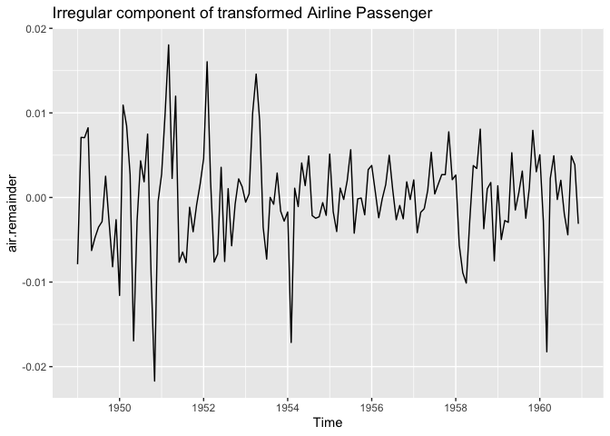<!-- -->

2)  Model identification using SACF/SPACF

<!-- end list -->

``` r
# Create the ACF and PACF plots
par(mfrow = c(1,2), cex = 0.5)
acf(air.remainder, lwd = 2, col = "red", main = NA)
pacf(air.remainder, lwd = 2, col = "red", main = NA)
```

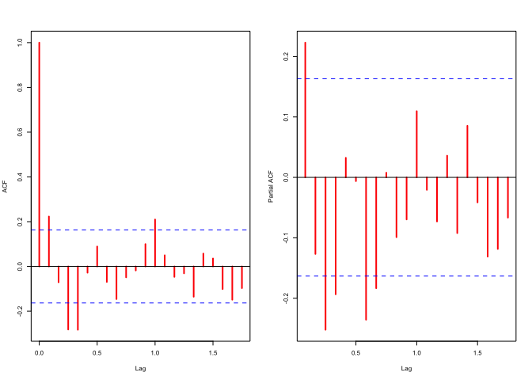<!-- -->

3)  Model estimation

<!-- end list -->

``` r
# Model selection based on ACF, PACF, and information criterion (aic)
mod.acf <- arima(air.remainder, c(0,0,12), include.mean = FALSE)
mod.pacf <- arima(air.remainder, c(8,0,0), include.mean = FALSE)
mod.auto <- auto.arima(air.remainder, seasonal = FALSE, stationary = TRUE, allowmean = FALSE)
```

Estimation Results

``` r
# Model selection based on acf
mod.acf
```

    ## 
    ## Call:
    ## arima(x = air.remainder, order = c(0, 0, 12), include.mean = FALSE)
    ## 
    ## Coefficients:
    ##          ma1      ma2      ma3     ma4      ma5     ma6      ma7      ma8
    ##       0.1061  -0.0764  -0.3713  -0.405  -0.0980  0.0705  -0.0626  -0.1729
    ## s.e.  0.0943   0.0968   0.0967   0.107   0.1002  0.1022   0.1032   0.1122
    ##           ma9     ma10    ma11    ma12
    ##       -0.0701  -0.0508  0.0271  0.1034
    ## s.e.   0.1094   0.0858  0.1221  0.0910
    ## 
    ## sigma^2 estimated as 2.564e-05:  log likelihood = 554.73,  aic = -1083.47

``` r
# Model selection based on pacf
mod.pacf
```

    ## 
    ## Call:
    ## arima(x = air.remainder, order = c(8, 0, 0), include.mean = FALSE)
    ## 
    ## Coefficients:
    ##          ar1      ar2      ar3      ar4      ar5     ar6      ar7      ar8
    ##       0.1366  -0.0470  -0.2591  -0.3049  -0.0145  0.0387  -0.2090  -0.1852
    ## s.e.  0.0825   0.0817   0.0812   0.0847   0.0847  0.0820   0.0816   0.0827
    ## 
    ## sigma^2 estimated as 2.679e-05:  log likelihood = 553.06,  aic = -1088.12

``` r
# Model selection based on aic
mod.auto
```

    ## Series: air.remainder 
    ## ARIMA(2,0,2) with zero mean 
    ## 
    ## Coefficients:
    ##          ar1      ar2      ma1     ma2
    ##       0.8483  -0.8404  -0.6200  0.6740
    ## s.e.  0.1077   0.1283   0.1588  0.1722
    ## 
    ## sigma^2 estimated as 3.096e-05:  log likelihood=545.01
    ## AIC=-1080.02   AICc=-1079.59   BIC=-1065.17

4)  Information criterion One of the most popular information criteria
    for selecting ARMA models is AIC. R defines AIC as
    \[ 2 \times k - 2 \times (loglikelihood)\] where k stands for the
    number of paraeters estimated in our model, including the variance
    of noise terms. Using this definition, we can reproduce the AIC for
    three fitted models.

<!-- end list -->

``` r
# Output from R
# names(mod.acf)
# Estimates of MA parameters # mod.acf$coef
# AIC from fitted MA model
mod.acf$aic
```

    ## [1] -1083.467

``` r
# Calculate AIC based on definition
2*(length(mod.acf$coef)+1)-2*mod.acf$loglik
```

    ## [1] -1083.467

Compare AIC among three fitted models:

``` r
list(MA12 = mod.acf$aic, AR8 = mod.pacf$aic, ARMA22 = mod.auto$aic)
```

    ## $MA12
    ## [1] -1083.467
    ## 
    ## $AR8
    ## [1] -1088.118
    ## 
    ## $ARMA22
    ## [1] -1080.021

5)  Model adequacy test The ARMA(2,2) model selected by `forecast`
    package does not pass the model adequacy test at the 95% CI.

<!-- end list -->

``` r
# Conduct Ljung-Box test
Box.test(mod.pacf$resid, lag = 24, type = c("Ljung-Box"), fitdf = 8)$p.value
```

    ## [1] 0.3049264

``` r
Box.test(mod.pacf$resid, lag = 24, type = c("Ljung-Box"), fitdf = 12)$p.value
```

    ## [1] 0.1060299

``` r
Box.test(mod.pacf$resid, lag = 24, type = c("Ljung-Box"), fitdf = 4)$p.value
```

    ## [1] 0.5656751

### Automatic model forecasting using `forcast` package in R

``` r
# Forecast based on Autoregressive model of order 8
d.forecast <- forecast(mod.pacf, level = c(95), h = 50)
autoplot(d.forecast)
```

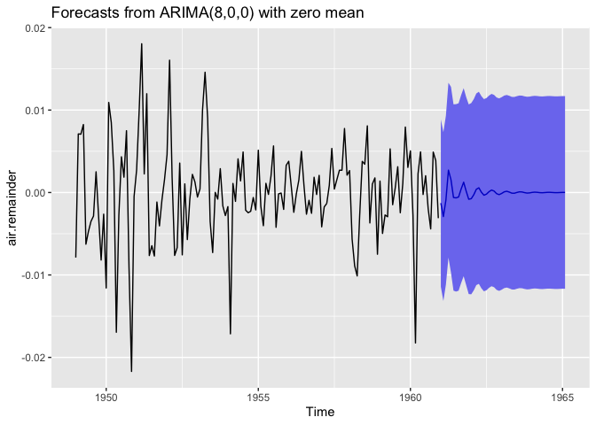<!-- -->

``` r
# Forecast the transformed AirPassengers using STL
autoplot(forecast(stlm(air, s.window = 35), level = c(95), h = 50))
```

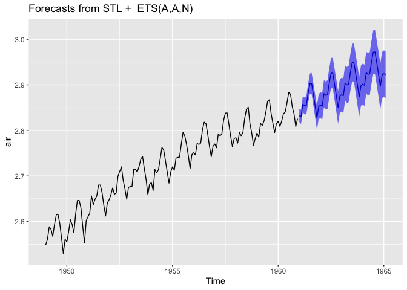<!-- -->

``` r
# Forecast the AirPassengers using STL
autoplot(forecast(stlm(AirPassengers, s.window = 35, lambda = lambda), level = c(95), h = 50))
```

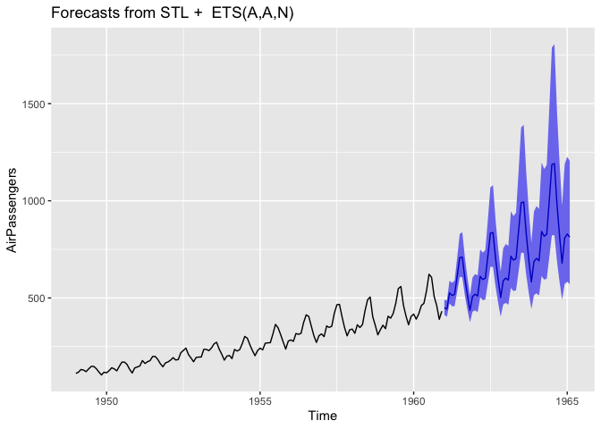<!-- -->
