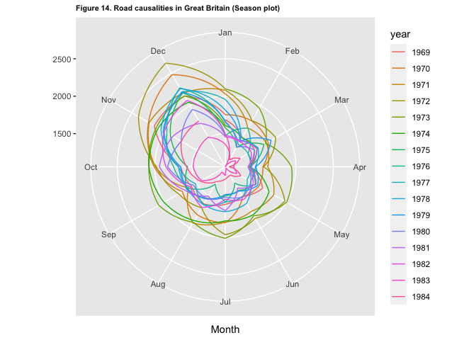

Forecasting: Principles and Practice
================
Jin Seo Jo
29/09/2020

## Examples of time series data

### Annual data

#### Electricity sales

Annual **electricity sales** to residential custormers in South
Australia from 1989 to 2008. Electricity (used for hot water has been
excluded)

``` r
elecsales
```

    ## Time Series:
    ## Start = 1989 
    ## End = 2008 
    ## Frequency = 1 
    ##  [1] 2354.34 2379.71 2318.52 2468.99 2386.09 2569.47 2575.72 2762.72 2844.50
    ## [10] 3000.70 3108.10 3357.50 3075.70 3180.60 3221.60 3176.20 3430.60 3527.48
    ## [19] 3637.89 3655.00

``` r
autoplot(elecsales) +
  ggtitle("Figure 1. Annual electricity sales") +
  ylab("Price") +
  theme(plot.title = element_text(size = 8, face = "bold"))
```

<!-- -->

#### Canadian Lynx trappings

Annual **numbers of lynx trappings** for 1821 - 1934 in Canada.

``` r
autoplot(lynx) +
  ggtitle("Figure 2. Annual Canadian Lynx Trappings") +
  xlab("Year") +
  ylab("Number trapped") +
  theme(plot.title = element_text(size = 8, face = "bold"))
```

<!-- -->

### Quarterly Data

#### Australian GDP per capita, 1971:Q3 - 1998:Q1

``` r
head(ausgdp, 14)
```

    ##      Qtr1 Qtr2 Qtr3 Qtr4
    ## 1971           4612 4651
    ## 1972 4645 4615 4645 4722
    ## 1973 4780 4830 4887 4933
    ## 1974 4921 4875 4867 4905

``` r
# start(ausgdp) # 1971 3
# end(ausgdp) # 1998 1
# frequency(ausgdp) # 4
autoplot(ausgdp) +
  ggtitle("Figure 3. Quarterly Australian GDP per capita") +
  ylab("GDP per capital") +
  theme(plot.title = element_text(size = 8, face = "bold"))
```

<!-- -->

#### Beer production

Total quarterly beer production in Australia (in megalitres) from
1956:Q1 to 2010:Q2

``` r
beer <- window(ausbeer, start = 1992)

autoplot(beer) +
  ggtitle("Figure 4. Quarterly beer production (Time series plot)") +
  theme(plot.title = element_text(size = 8, face = "bold"))
```

<!-- -->

``` r
ggsubseriesplot(beer) +
  ggtitle("Figure 5. Quarterly beer production (Subseries plot)") +
  theme(plot.title =  element_text(size = 8, face = "bold"))
```

<!-- -->

``` r
ggseasonplot(beer, polar = TRUE) +
  ggtitle("Figure 6. Quarterly beer production (Season plot)") +
  theme(plot.title = element_text(size = 8, face = "bold"))
```

<!-- -->

``` r
# Alternative option
ggseasonplot(beer, year.labels = TRUE) +
  ggtitle("Figure 7. Quarterly beer production (Season plot)") +
  theme(legend.text = element_text(size = 8, face = "bold"))
```

<!-- -->

### Monthly data

#### Air Passengers

Monthly totals of international airline passengers from 1949 to 1960.

``` r
data("AirPassengers")

# start(AirPassengers)
# end(AirPassengers)
# frequency(AirPassengers)

p <- autoplot(AirPassengers) +
  ggtitle("Figure 8. Monthly totals of international airline passengers") +
  ylab("Number of passengers (1000's)") +
  theme(plot.title = element_text(size = 8, face = "bold"))

p
```

<!-- -->

``` r
ggsubseriesplot(AirPassengers) +
  ylab("1000's") +
  ggtitle("Figure 9. Monthly airline passengers") +
  theme(plot.title = element_text(size = 8, face = "bold"))
```

<!-- -->

``` r
ggseasonplot(AirPassengers, polar = TRUE) +
  ggtitle("Figure 10. Monthly airline passengers (Season plot 1)") +
  theme(plot.title = element_text(size = 8, face = "bold"))
```

<!-- -->

``` r
ggseasonplot(AirPassengers, year.labels = TRUE, year.labels.left = TRUE) +
  ggtitle("Figure 11. Monthly airline passengers (Season plot 2)") +
  ylab("Number of passengers (1000's)") +
  theme(plot.title = element_text(size = 8, face = "bold"))
```

<!-- -->

#### Road causalities in Great Britain 1969-84

UKDriverDeaths is a time seires giving the monthly totals of car drivers
in Great Britain killed or seriously injured Jan 1969 to Dec 1984.
Compulsory wearing of seat belts was introduced on 31 Jan 1983.

``` r
data("UKDriverDeaths")

autoplot(UKDriverDeaths) +
  ggtitle("Figure 12. Road causalities in Great Britain") +
  ylab("Number of deaths") +
  theme(plot.title = element_text(size = 8, face = "bold"))
```

<!-- -->

``` r
ggsubseriesplot(UKDriverDeaths) +
  ggtitle("Figure 13. Road causalities in Great Britain (Subseries plot)") +
  ylab("Number of deaths") +
  theme(plot.title = element_text(size = 8, face = "bold"))
```

<!-- -->

``` r
ggseasonplot(UKDriverDeaths, polar = TRUE) +
  ggtitle("Figure 14. Road causalities in Great Britain (Season plot)") +
  theme(plot.title = element_text(size = 8, face = "bold"))
```

<!-- -->

### Other frequency

US treasury bill contracts on the Chicago market for 100 consecutive
trading days in 1981.

``` r
autoplot(ustreas) +
  ggtitle("Figure 15. US Treasury Bill Contracts") +
  xlab("Day") +
  ylab("Price") +
  theme(plot.title = element_text(size = 8, face = "bold"))
```

<!-- -->

## Patterns in time series data

Three patterns are observed in time series data:  
1\. Trend pattern exists when there is a long-term increase or decrease
in the data.  
2\. Seasonal pattern exists when a series is influenced by seasonal
factors (e.g., the quarter of the year, the month, or day of the
week).  
3\. Cyclical pattern exists when data exhibit rises and falls that are
not of fixed period (duration usually of at least 2 years)

## Measuring temporal dependence

### Common tools

``` r
beer <- window(ausbeer, start = 1992)

p00 <- autoplot(beer) +
  ggtitle("Beer production") +
  theme(plot.title = element_text(size = 8, face = "bold"))

p01 <- ggsubseriesplot(beer) +
  ggtitle("Beer production (Subseries plot)") +
  theme(plot.title = element_text(size = 8, face = "bold"))

multiplot(p00, p01, cols = 2)
```

<!-- -->

1.  **Lagged scatterplot**: Each graph shows \(y_{t}\) plotted against
    \(y_{y-k}\) for different values of k.

<!-- end list -->

``` r
forecast::gglagplot(beer) +
  ggtitle("Figure 16, Beer production (Lagged plot)") +
  theme(plot.title = element_text(size = 8, face = "bold"))
```

<!-- -->

2.  **Autocorrelation plots (aka correlogram)**: The autocorrelations
    are the correlations associated with these scatterplots.
    Mathematically, the autocorrelation function at lag k may be defined
    as
    \[p(k) = \frac{cov(y_{t},y_{t-k})}{\sqrt{var(y_{t})var(y_{t-k})}}\]

<!-- end list -->

``` r
ggAcf(beer) +
  ggtitle("Figure 17. Beer production (ACF)") +
  theme(plot.title = element_text(size = 8, face = "bold"))
```

<!-- -->

### Autocorrelation plots for a white noise process

A stochastic process \(\{y_{t}\}\) is called a white noise process if
\(y_{t}\) satisfies  
1\. \(E(y_{t}) = 0 \; \forall t\)  
2\. \(var(y_{t}) = cov(y_{t}, y_{t}) = {\sigma^2}\) is a constant.  
3\. \(\gamma(t,s) = cov(y_{t}, y_{s}) = 0 \; \forall t \neq s\)

``` r
set.seed(1234)

y <- ts(rnorm(100))

p1 <- autoplot(y) +
  ggtitle("Time series plot of white noise") +
  theme(plot.title = element_text(size = 8, face = "bold"))

p2 <- ggAcf(y, lag.max = 20) +
  ggtitle("White noise (ACF)") +
  theme(plot.title = element_text(size = 8, face = "bold"))

multiplot(p1, p2, cols = 2)
```

<!-- -->

### Autocorrelation plos for data with trend and seasonality

``` r
elec <- window(elec, start = 1980)

p3 <- autoplot(elec) +
  ggtitle("Electricity production") +
  theme(plot.title = element_text(size = 8, face = "bold"))

p4 <- ggAcf(elec, lag.max = 48) +
  ggtitle("Electricity production (ACF)") +
  theme(plot.title = element_text(size = 8, face = "bold"))

multiplot(p3, p4, cols = 2)
```

<!-- -->

**Remark:**  
1\. When data have a trend, the autocorrelations for small lags tend to
be large and positive.  
2\. When data are seasonal, the autocorrelations will be larger at the
seasonal lags (i.e., at multiples of the seasonal frequency)  
3\. When data are trended and seasonal, you see a combination of these
effects.
