House Price in Vancouver
================
Jin Seo Jo
28/09/2020

## Data used in conventional statistics

Conventional statistical analysis assumes data is identically and
independently distributed (IID). In other words, observation have a
constant mean (variance), and are
independent.

``` r
house_data <- ts(read.csv("House_Price_Index.csv"), frequency = 12, start = c(1990, 7))
ts.dat <- fortify(house_data)
len <- length(ts.dat$Index)
set.seed(5678)
X <- rnorm(len)
benchmark.ts  <- ts(X, frequency = 12, end = c(2020, 4))
autoplot(benchmark.ts) +
  ggtitle("IID Gaussian Time Series") +
  labs(caption = "simulated standard normal random variables") +
  theme_minimal()
```

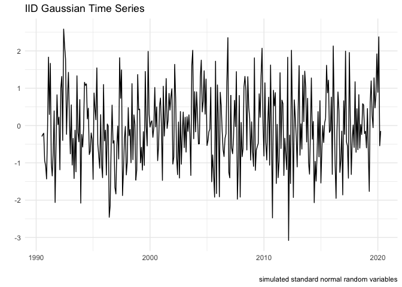<!-- -->

## Stylized fact of time series

Time series data usually exhibit gradual (or secular) change in mean,
seasonal/cycical change in mean, and observations are correlated.

### Trend

Victoria (black) and Vancouver (navy) (monthly) House Price Index from
July 1990 to April 2020.

``` r
ggplot(data = ts.dat) +
  geom_line(aes(x = Index, y = Victoria)) +
  geom_line(aes(x = Index, y = Vancouver), col = "navy") +
  theme_fivethirtyeight() +
  ggtitle("House Price Index") +
  labs(caption = c("black: Victoria, navy: Vancouver"))
```

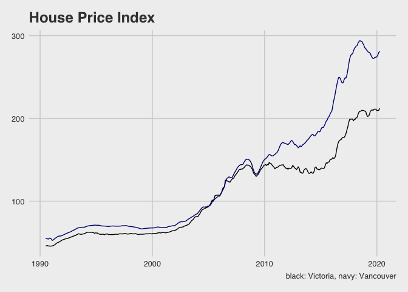<!-- -->

### Seasonal/Cyclic

Victoria (black) and Vancouver (navy) (monthly) Sales Pair Counts from
July 1990 to April 2020.

``` r
ggplot(data = ts.dat) +
  geom_line(aes(x = Index, y = Victoria_count)) +
  geom_line(aes(x = Index, y = Vancouver_count), col = "navy") +
  theme_fivethirtyeight() +
  ggtitle("BC sales pair counts")
```

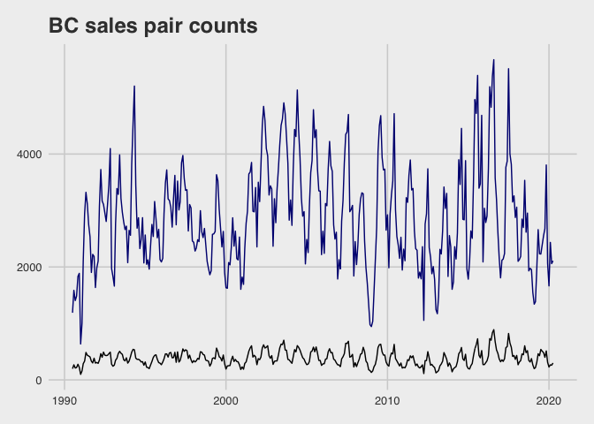<!-- -->

``` r
vc_count <- ts(ts.dat$Vancouver_count, frequency = 12, end = c(2020, 4))
vic_count <- ts(ts.dat$Victoria_count, frequency = 12, end = c(2020, 4))

ggsubseriesplot(vc_count) + 
  theme_fivethirtyeight() +
  ggtitle("Vancouver (sales pair counts)")
```

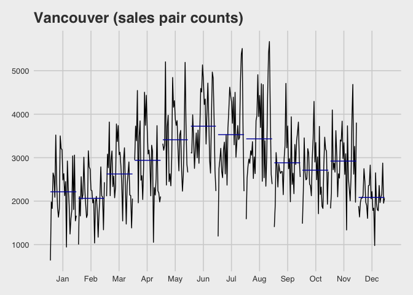<!-- -->

Simulated white noise time series again

``` r
ggsubseriesplot(benchmark.ts) +
  theme_fivethirtyeight() +
  ggtitle("IID Gaussian time series")
```

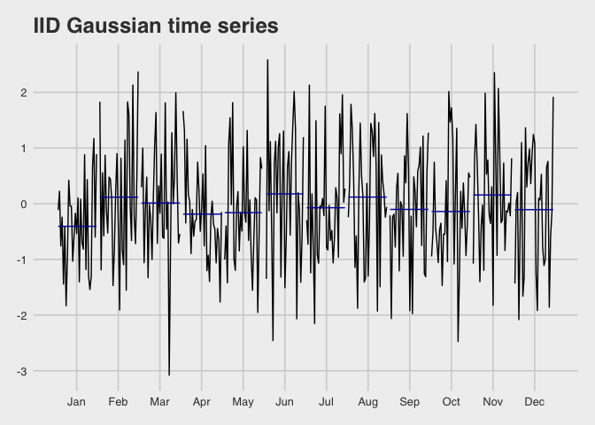<!-- -->

The vic\_elec data contains half-hourly electricity demand for the state
of Victoria, Australia

``` r
vic_elec %>% gg_season(Demand, period = "week") +
  theme_fivethirtyeight() +
  theme(legend.position = "none")
```

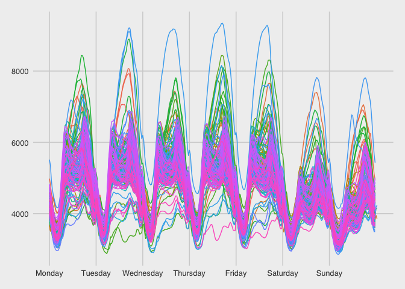<!-- -->

### Temporal correlation/ serial correlation/ autocorrelation

Simulated IID N(0,1) over two consecutive observations

``` r
df0 <- data.frame(X0 = X[-1], X1 = X[-len])

ggplot(data = df0) +
  geom_point(aes(x = X1, y = X0)) +
  ggtitle("Simulated IID N(0,1)")
```

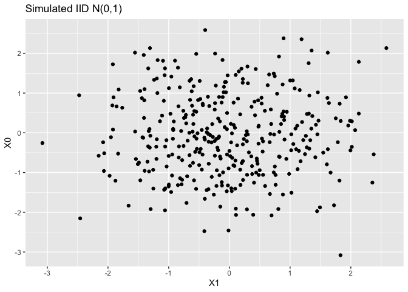<!-- -->

Sales pair counts over two consecutive months

``` r
df <- data.frame(vc_count0 = vc_count[-1], vc_count1 = vc_count[-len])
df1 <- data.frame(vic_count0 = vic_count[-1], vic_count1 = vic_count[-len])
g1 <- ggplot(data = df) +
  geom_point(aes(x = vc_count1, y = vc_count0)) +
  ggtitle("Vancouver")
g2 <- ggplot(data = df1) +
  geom_point(aes(x = vic_count1, y = vic_count0)) +
  ggtitle("Victoria")
grid.arrange(g1, g2, ncol = 2)
```

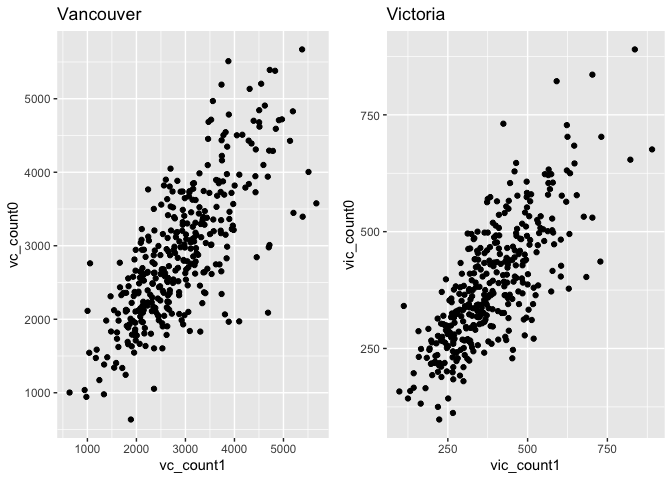<!-- -->

Autocorrelation functions

``` r
ggAcf(vc_count) +
  theme_fivethirtyeight() +
  ggtitle("Vancouver")
```

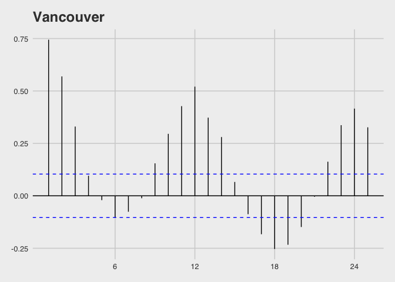<!-- -->

``` r
ggAcf(vic_count) +
  theme_fivethirtyeight() +
  ggtitle("Victoria")
```

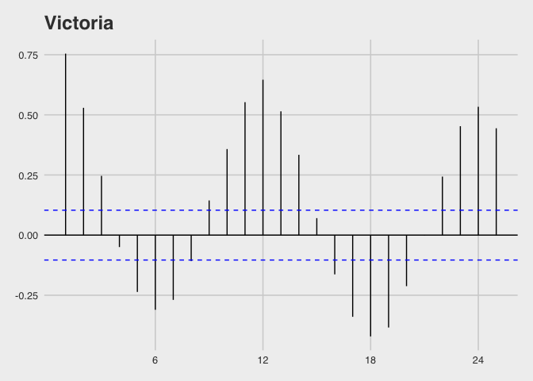<!-- -->

``` r
ggAcf(benchmark.ts) +
  theme_fivethirtyeight() +
  ggtitle("Simultaed IID N(0,1)")
```

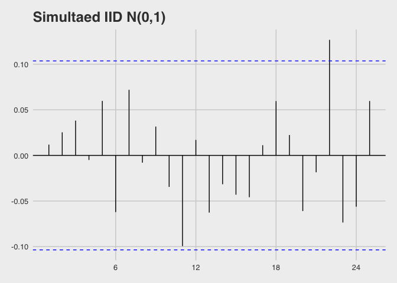<!-- -->

### Unstable (unstationary)

``` r
adf.test(benchmark.ts)
```

    ## Warning in adf.test(benchmark.ts): p-value smaller than printed p-value

    ## 
    ##  Augmented Dickey-Fuller Test
    ## 
    ## data:  benchmark.ts
    ## Dickey-Fuller = -5.9764, Lag order = 7, p-value = 0.01
    ## alternative hypothesis: stationary

## Time Series Decomposition

``` r
vc_count %>% stl(t.window = 13, s.window = "periodic", robust = TRUE) %>% 
  autoplot() +
  ggtitle("Sales pair counts (Vancouver)") +
  theme_fivethirtyeight()
```

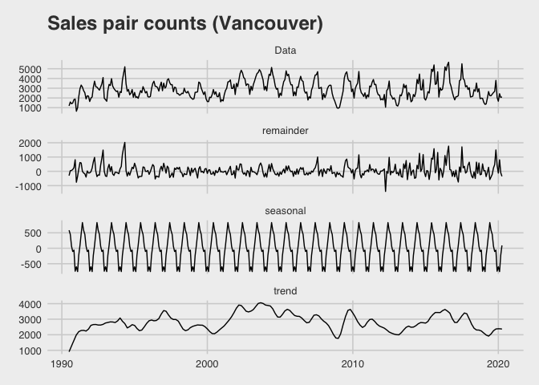<!-- -->

## Forecasting

``` r
fit1 <- stlf(vc_count, method = "rwdrift")
fit2 <- stlf(vc_count, method = "arima")
fit3 <- stlf(vc_count, method = "ets")
fit4 <- stlf(vc_count, method = "naive")

l1 <- autoplot(fit1) + ggtitle("random walk") + theme_fivethirtyeight()
```

    ## Warning: `filter_()` is deprecated as of dplyr 0.7.0.
    ## Please use `filter()` instead.
    ## See vignette('programming') for more help
    ## This warning is displayed once every 8 hours.
    ## Call `lifecycle::last_warnings()` to see where this warning was generated.

``` r
l2 <- autoplot(fit2) + ggtitle("arima") + theme_fivethirtyeight()
l3 <- autoplot(fit3) + ggtitle("ets") + theme_fivethirtyeight()
l4 <- autoplot(fit4) + ggtitle("naive") + theme_fivethirtyeight()

grid.arrange(l1, l2, l3, l4, ncol = 2)
```

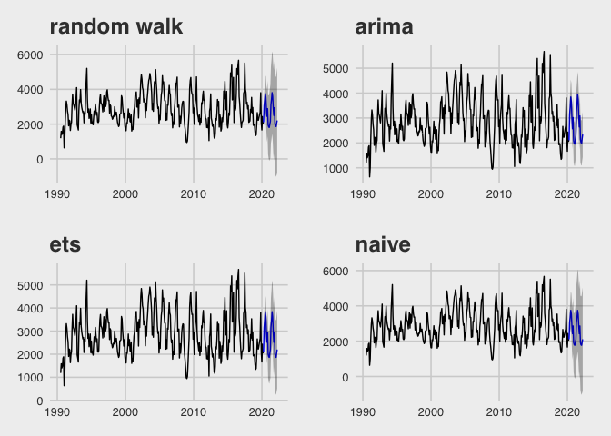<!-- -->
